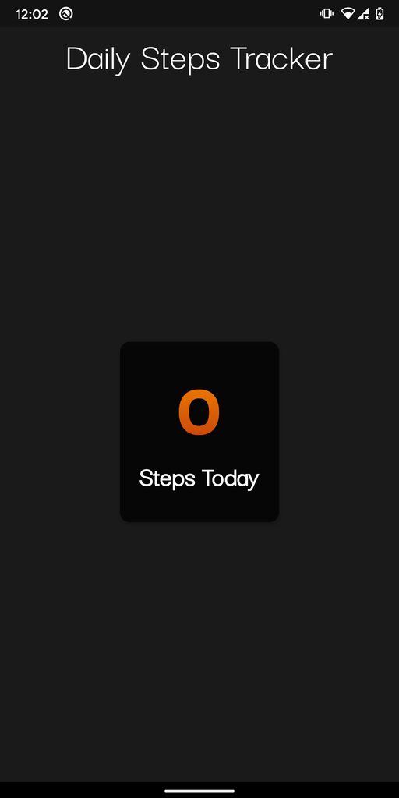

# daily_steps

 This is a Flutter app sample that demonstrates tracking daily steps in Flutter.

 Blog post: https://blog.maskys.com/implementing-a-daily-step-count-pedometer-in-flutter/

 **Note:** To get this working on iOS, please do not forget to carry out the steps mentioned [here](https://github.com/cph-cachet/flutter-plugins/tree/master/packages/pedometer).
